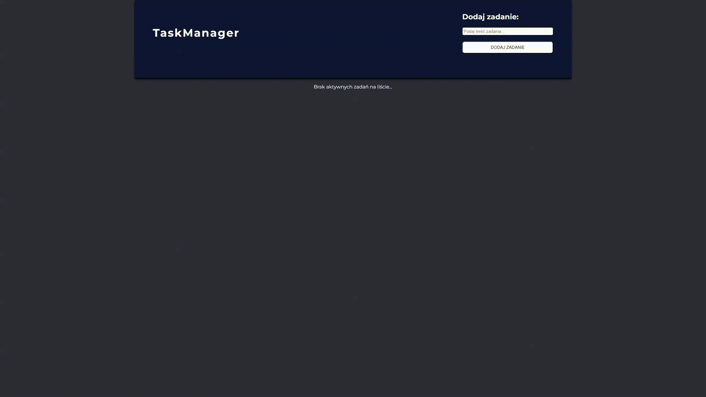

# Tasks Manager



### Hi there! 👋 <br/>
Thanks for viewing my repository!
This project aimed to create an application used for task management. The app was built with React and uses **class components**. The tasks data is stored in a *local database* and retrieved using a **local API (JSON Server)**.


## 📎 Features

- Create *new tasks*;
- Input validation;
- Task management:
    - *start the countdown*;
    - *stop the countdown*;   
    - *delete tasks*;
    - *finish task*.


## 🔧 Built with


 
 <br/>


 <br/>


## ⚙️ Installation

The project uses [node](https://nodejs.org/en/) and [npm](https://www.npmjs.com/). To run the app on your machine you should install all dependencies. Then create a localhost port and run your web explorer.

Let's start with installing all dependencies. Move to the app main workspace and run:
```
   npm i
```
To create a localhost port you should type:
```
   npm run start
```   
If you don't have JSON server installed on your device use command:
```
   npm install json-server -g
```
To run JSON server use command:
```
   json-server --watch ./db/data.json --port 3005
```
Your **Tasks Manager** is ready at port 8080.
```
   http://localhost:8080/
``` 


## 💭 Improvements for future
- divide the app into appropriate components;
- add a loader while downloading data from the database. 

## 🙋‍♂️ Feel free to contact me
If you have any questions feel free to get in touch with me (contact in the [profile readme](https://github.com/mmcode9407)).

## 🙏 Special thanks
Special thanks to my [Mentor - devmentor.pl](https://devmentor.pl/) for providing me with the task and code review.
